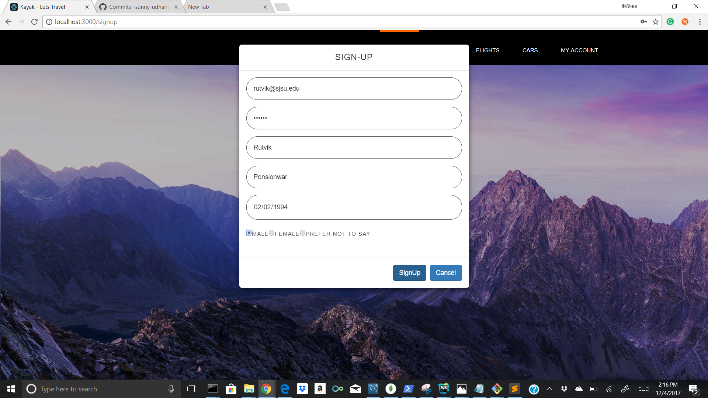
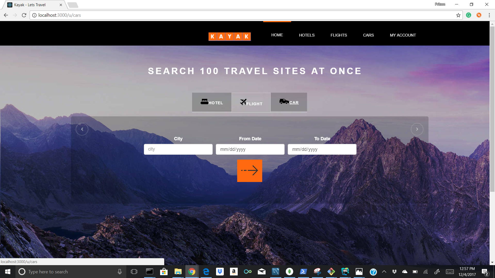
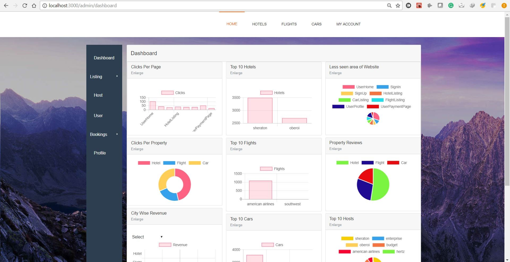
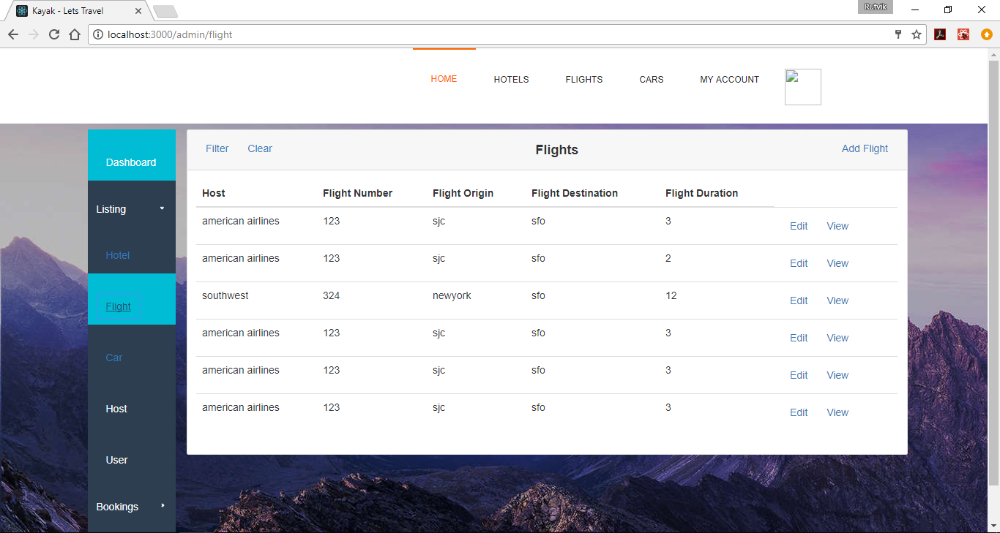

<link rel="stylesheet" href="readme-src/modest.css">

# Online Travel Reservation

## Goal

* The goal is to build a distributed enterprise web application which enables the user not only to search for Cars, Hotels and Flights and make a booking but also login/signup along with editing user preferences and viewing travel history. As well as create a Admin side which can be used to add/edit/delete Flights, Cars and Hotels and also be able to delete the user and view the analytics/statistics.

## System Design

### Technology stack

 
<table>
<thead>
<tr>
<th>Area</th>
<th>Technology</th>
</tr>
</thead>
<tbody>
	<tr>
		<td>Front-End</td>
		<td>React, Redux, React Router, Bootstrap, HTML5, CSS3, Javascript ( ES6 )</td>
	</tr>
	<tr>
		<td>Analytics Graphs</td>
		<td>D3.js</td>
	</tr>
	<tr>
		<td>Message-oriented middleware</td>
		<td>Apache Kafka</td>
	</tr>
	<tr>
		<td>Authentication Middleware</td>
		<td>Passport.js</td>
	</tr>
	<tr>
		<td>Back-End</td>
		<td>Express, Node.js</td>
	</tr>
	<tr>
		<td>In-Memory Caching / Datastore</td>
		<td>Redis</td>
	</tr>
	<tr>
		<td>Search and Analytics Engine</td>
		<td>Elasticsearch</td>
	</tr>
	<tr>
		<td>API Testing</td>
		<td>Mocha, Postman</td>
	</tr>
	<tr>
		<td>Performance Testing</td>
		<td>JMeter</td>
	</tr>
	<tr>
		<td>Database</td>
		<td>MySQL (Google Cloud Platform), MongoDB (Mongo Atlas on AWS)</td>
	</tr>
    <tr>
		<td>Deployment</td>
		<td>Google Compute Engine</td>
	</tr>
</tbody>
</table>
 

### Database
> Tables with large amount of data and which doesn't need transaction support in mongodb, flight car hotel
Tables with critical data and information that needs transaction support in mysql, like booking details, payment details and user info

## Screenshots

##### Login/Signup

##### Home - Hotels

##### Home - Flights

##### Home - Cars

##### Hotel Listing

##### Car Listing

##### Flight Listing

##### Booking page

##### User Home

##### Analytics

##### Admin Flight - Add/Edit/Search

##### Admin Hotel - Add/Edit/Search

##### Admin Car - Add/Edit/Search

